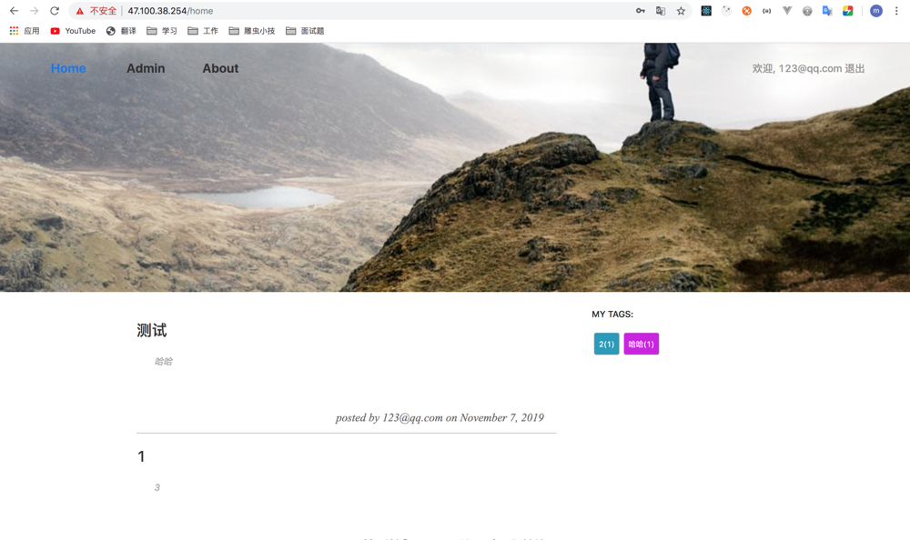
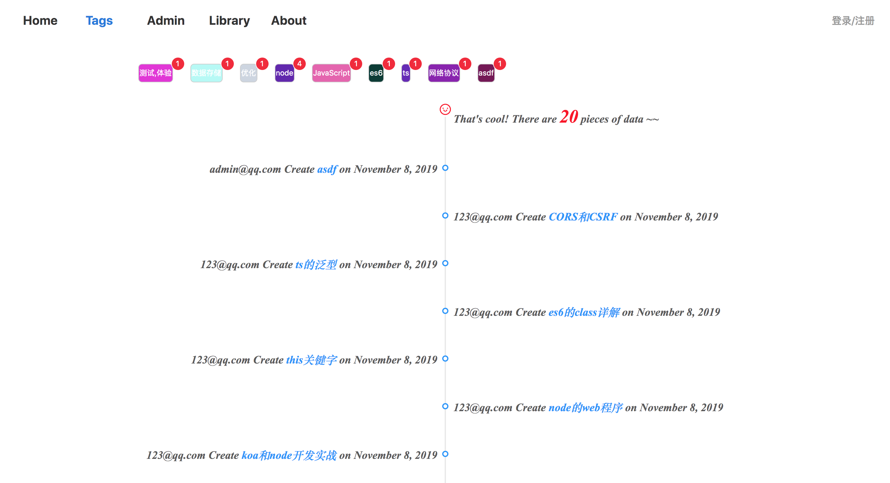
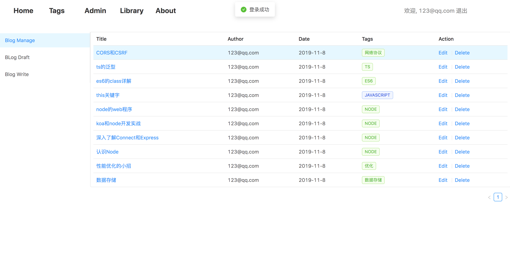
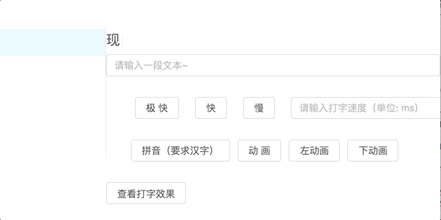

# Blog-React

> 一个 React + node 的**初/中级**练习项目：可以多人共用的博客系统

[**在线预览**](http://47.100.38.254/)
---
home

---
tags

---
manage

---
charts

---
typewriting

---


## 技术栈
react + antd + dva + node + koa + mongoose

## 麻雀虽小，五脏俱全

- [x] 前台：主页 + 列表页 + 标签页 + 博客管理 + 写博客 + 草稿箱
- [x] 后台：文章管理 + 用户管理
- [x] 登录注册， 管理自己的个人博客，查看所有发布的博客
- [x] Library: 一些有意思的东西， 已实现： canvas， 画板， 自定义数据可视化大屏 


### 目录结构

```js
.
│
├─config                // 构建配置
├─public                // html 入口
├─scripts               // 项目脚本
└─server                // 后端
    ├─config            // 项目配置 
    ├─db                // 连接数据库
    ├─middlewares       // 中间件
    ├─models            // 数据库模型
    ├─route            // 路由
    ├─  app.js          // 后端主入口文件
    └─...
│
└─src                   // 前端项目源码
   ├─assets             // 静态文件
   ├─components         // 公用组件
   ├─config             // 公共数据常量
   ├─models             // dva的models， 整合了state， reducer， redux-saga
   ├─route              // 路由
   ├─utils              // 工具包
   ├─views              // 视图层
   ├─  App.js           // 项目入口文件
   ├─  index.js         // 主入口文件，引入dva
   └─...

```

## 使用这个项目

```bash
git clone https://github.com/MasonEast/react-blog.git

## 安装依赖以及开启开发模式
cd blog-react
npm i 
npm start

## 启动node服务本地要先安装mongodb数据库，并启动
cd server
npm i 
node app

```
